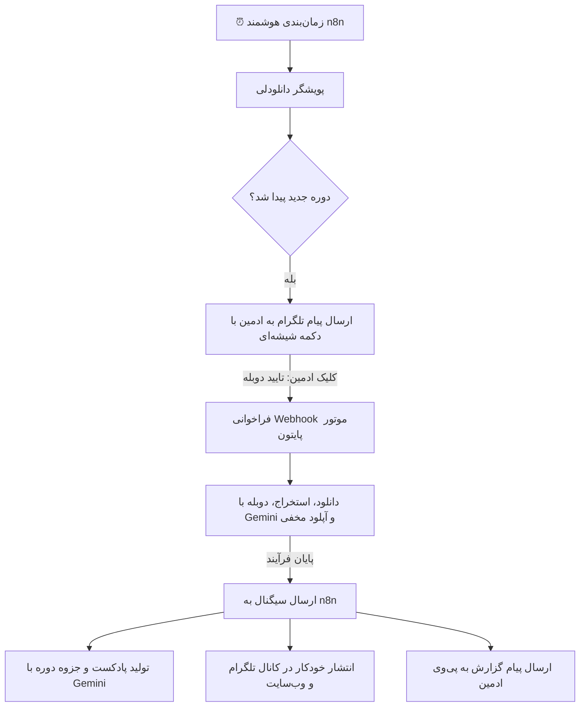

# 📺 سند جامع معماری، فیچرها و نقشه راه استراتژیک RPIM TV
> **نسخه:** 1.0.0 | **تاریخ تدوین:** سپتامبر ۲۰۲۶  
> **هدف سند:** تجمیع کلیه تصمیمات، نیازمندی‌ها، نوآوری‌ها و نقشه راه اجرایی پلتفرم «تلویزیون آنلاین آموزش‌های تخصصی RPIM TV» جهت پیاده‌سازی گام‌به‌گام بدون فراموشی.

---

## فهرست سرفصل‌ها
1. [هویت و فلسفه برندینگ RPIM TV](#۱-هویت-و-فلسفه-برندینگ-rpim-tv)
2. [موتور هوش مصنوعی و دوبله با صدای رسمی NotebookLM](#۲-موتور-هوش-مصنوعی-و-دوبله-با-صدای-رسمی-notebooklm)
3. [بهره‌برداری ۱۰۰٪ از ظرفیت‌های NotebookLM گوگل](#۳-بهره‌برداری-۱۰۰-از-ظرفیت‌های-notebooklm-گوگل)
4. [معماری اتوماسیون محلی با n8n روی سرور](#۴-معماری-اتوماسیون-محلی-با-n8n-روی-سرور)
5. [معماری مخفی توزیع و فضای ابری تلگرام (Invisible CDN)](#۵-معماری-مخفی-توزیع-و-فضای-ابری-تلگرام-invisible-cdn)
6. [مدیریت و پوشش هوشمند لوگوی دانلودلی](#۶-مدیریت-و-پوشش-هوشمند-لوگوی-دانلودلی)
7. [پلیر ویدیویی نسل جدید و امکانات تعاملی](#۷-پلیر-ویدیویی-نسل-جدید-و-امکانات-تعاملی)
8. [مسیرهای شغلی، جامعه کاربری و گواهی مهارت](#۸-مسیرهای-شغلی-جامعه-کاربری-و-گواهی-مهارت)
9. [قانون همیشگی مهندسی: پروتکل اجباری تست E2E](#۹-قانون-همیشگی-مهندسی-پروتکل-اجباری-تست-e2e)
10. [فازبندی و اولویت‌های اجرایی](#۱۰-فازبندی-و-اولویت‌های-اجرایی)

---

## ۱. هویت و فلسفه برندینگ RPIM TV

### اهداف راهبردی:
* تبدیل پلتفرم از یک «استودیوی دوبله ماشینی» به یک **رسانه و تلویزیون آنلاین معتبر برای آموزش‌های تخصصی مهندسی، دواپس و برنامه‌نویسی**.
* حذف کامل تمام سرنخ‌های فنی، المان‌های دولوپری، تب‌های اضافی و لاف‌زدن‌های هوش مصنوعی از دید مخاطبان عمومی.
* استقرار هویت یکپارچه سازمانی با شعار: **«تماشای روان برترین دوره‌های دنیا با دوبله فارسی سلیس و کیفیت Full HD»**.

### تغییرات اعمال‌شده:
* حذف لینک‌های ادمین و استودیو (`/admin/studio`) از هدر، فوتر و دراور موبایل.
* طراحی هدر مدرن با نشان زنده `LIVE TV` و ناوبری دسته‌بندی‌شده.
* فوتر رسمی رسانه‌ای با معرفی مسیرهای آموزشی و کانال رسمی تلگرام (`@rpimtv`).

---

## ۲. موتور هوش مصنوعی و دوبله با صدای رسمی NotebookLM

### مشخصات فنی:
* **مدل پایه گفتار:** ادغام با موتور گفتاری Google Gemini (`gemini-2.5-flash-preview-tts`).
* **صداهای رسمی پادکست‌های گوگل:**
  * گوینده مرد: **`Puck`** (تن صدای گرم، پرانرژی، صمیمی و لحن تخصصی مهندسی).
  * گوینده زن: **`Aoede`** (تن صدای شیوا، شفاف و آرامش‌بخش).
* **پایپ‌لاین تبدیل صدا:** تبدیل خطی جریان‌های صوتی PCM 24kHz به فایل‌های استاندارد موج صوتی (WAV).
* **مکانیزم تاب‌آوری (Failover):** سوییچ خودکار و بی‌وقفه به موتور Edge-TTS (`fa-IR-FaridNeural` و `fa-IR-DilaraNeural`) در صورت بروز محدودیت سهمیه (HTTP 429) یا قطعی موقت کلود.

---

## ۳. بهره‌برداری ۱۰۰٪ از ظرفیت‌های NotebookLM گوگل

برای به حداکثر رساندن ارزش محتوای هر دوره، قابلیت‌های زیر رسماً به خط تولید اضافه می‌شوند:

### ۳.۱. پادکست‌های عمیق خلاصه دوره (Audio Deep Dive - ۱۵ دقیقه‌ای)
* **عملکرد:** کل متن دوره توسط مدل ۲ میلیون توکنی Gemini تجزیه و تحلیل می‌شود و یک گفتگوی رادیویی دو نفره پرحرارت بین دو مهندس (با صداهای `Puck` و `Aoede`) خلق می‌شود.
* **ارزش افزوده:** کاربر پیش از دیدن دوره ۱۰ ساعته، در ۱۵ دقیقه رانندگی یا پیاده‌روی، پادکست نقشه راه و اهداف دوره را گوش می‌دهد.

### ۳.۲. تولید خودکار کتابچه راهنما و کدهای جلسه (Study Guide & Cheatsheet)
* ساخت خودکار ۳ سند استاندارد با لوگوی رسمی RPIM TV برای هر دوره:
  1. **دفترچه تقلب دستورات (Terminal & Code Cheatsheet):** کلیه دستورات داکر، کوبرنتیز، پایتون و گیت تایپ‌شده در ویدیو.
  2. **راهنمای گام‌به‌گام مطالعه (Study Guide):** اهداف یادگیری و پروژه نهایی هر فصل.
  3. **پرسش و پاسخ مصاحبه کاری (Exam/Interview FAQ):** ۱۰ سوال کلیدی مصاحبه کاری برآمده از محتوای همان دوره.

### ۳.۳. دستیار هوشمند اختصاصی در پلیر («از این دوره بپرس»)
* موتور جستجوی مباحث بر پایه RAG دقیق بدون حدس و خطا؛ پاسخ به سوالات فنی کاربر با استناد به ثانیه دقیق ویدیو.

### ۳.۴. ادغام کانتکست پیش از ترجمه (Global Course Context)
* تجزیه و تحلیل پروژه نهایی دوره قبل از شروع ترجمه قسمت اول، تا تلفظ و معادل‌سازی اصطلاحات تخصصی از ابتدا تا انتها یکدست و هماهنگ باشد.

---

## ۴. معماری اتوماسیون محلی با n8n روی سرور

استفاده از n8n به صورت **لوکال روی سرور** (سبک با مصرف حدود ۲۰۰ مگابایت رم) به عنوان رهبر ارکستر فرآیندها:

### نقش‌های تفکیک‌شده n8n:
* **تاییدیه انسانی در تلگرام (Human-in-the-Loop):** ارسال دکمه‌های «🟢 تایید و شروع خط تولید» و «🔴 رد دوره» به پی‌وی ادمین.
* **انتشار خودکار مولتی‌پلتفرم:** آماده‌سازی کاور، کپشن و تگ‌های موضوعی و ارسال به کانال رسمی تلگرام (`@rpimtv`) و سایت.
* **مانیتورینگ و خودترمیمی (Self-Healing):** تشخیص خطاهای احتمالی شبکه، ری‌تری هوشمند بعد از ۱ ساعت و ارسال پیام هشدار به تلگرام.

---

## ۵. معماری مخفی توزیع و فضای ابری تلگرام (Invisible CDN)

### اصول محرمانگی و فنی:
* تلگرام صرفاً به عنوان یک **انبار ذخیره‌سازی ابری نامحدود و رایگان (Object Storage)** در پشت پرده عمل می‌کند.
* **هیچ کاربری نباید متوجه استفاده از تلگرام شود:**
  * کلیه ویدیوها از طریق پروکسی استریمینگ سایت (`/api/stream/...`) به صورت رمزنگاری‌شده و سگمنت به سگمنت (HTTP 206 Partial Content) پخش می‌شوند.
  * لینک‌های تلگرام هرگز در سورس‌کد فرانت‌اند یا کنسول مرورگر کاربر مشاهده نمی‌شوند.

---

## ۶. مدیریت و پوشش هوشمند لوگوی دانلودلی

### استراتژی انتخابی: پوشش در سطح پلیر (Smart Player Bug / Station Badge)
* **دلایل انتخاب:**
  1. سرعت خط تولید فوق‌سریع حفظ می‌شود (بدون نیاز به رندر مجدد ویدیو با FFmpeg).
  2. افت کیفیت صفر درصد و رزولوشن 1080p دست‌نخورده می‌ماند.
  3. بار پردازشی سرور به حداقل می‌رسد.
* **پیاده‌سازی:**
  * درج یک کامپوننت شیشه‌ای و مدرن با لوگوی **`RPIM TV • پخش اختصاصی 1080p`** با نشانگر نوری زنده (Live Indicator) دقیقا روی گوشه‌ای از تصویر که لوگوی دانلودلی قرار دارد، به صورت دائمی و غیرقابل کلیک (`pointer-events-none`).

---

## ۷. پلیر ویدیویی نسل جدید و امکانات تعاملی

1. **سوییچ آنی دو کاناله صوت (Dual-Audio Track):**
   * دکمه انتخاب زبان صوت در لحظه بدون رفرش ویدیو:
     * 🇮🇷 دوبله فارسی روان (Gemini NotebookLM Voice)
     * 🇬🇧 زبان اصلی انگلیسی مدرس
2. **فصل‌بندی هوشمند نوار پیشرفت (Auto-Chapters):**
   * تفکیک هوشمند جلسه به مباحث مجزا در تایم‌لاین ویدیو بر اساس محتوا.
3. **حالت پادکست و فقط صوتی (Audio-Only Mode):**
   * امکان تماشای خاموش و استریم فقط صوت برای کاهش ۹۰ درصدی مصرف اینترنت در مسیر و مترو.
4. **کپی‌کننده کدهای ویدیویی با یک کلیک (Code Copy Box):**
   * نمایش کدهای نوشته‌شده توسط مدرس زیر پلیر به همراه دکمه کپی به کلیپ‌بورد.
5. **زیرنویس همگام تعاملی (Interactive Transcript):**
   * هایلایت زنده متن کلمه به کلمه همراه با صدای گوینده و امکان پرش زمانی با کلیک روی هر کلمه.
6. **یادداشت‌برداری متصل به ثانیه (Timestamped Personal Notes):**
   * ذخیره یادداشت‌های کاربر در پروفایل و پرش مستقیم به همان ثانیه ویدیو.

---

## ۸. مسیرهای شغلی، جامعه کاربری و گواهی مهارت

1. **نقشه‌های راه شغلی (Learning Paths):**
   * چینش دوره‌ها در قالب زنجیره‌های مهارتی هدفمند (مانند «مسیر ارشد دواپس»، «متخصص مایکروسرویس»، «مهندس هوش مصنوعی»).
2. **سیستم استمرار یادگیری (Daily Streak & Badges):**
   * اعطای بج‌های مهارتی به ازای دیدن منظم ویدیوها در روزهای متوالی.
3. **گواهی دیجیتال پایان دوره با کد اعتبارسنجی آنلاین:**
   * صدور سرتیفیکیت رسمی دو زبانه با لینک استعلام آنلاین اختصاصی در `rpim.ir/verify/...`.

---

## ۹. قانون همیشگی مهندسی: پروتکل اجباری تست E2E

### اصل تخطی‌ناپذیر:
> **هیچ تغییری نباید پیش از اجرای موفقیت‌آمیز تست‌های خودکار سرتاسری (End-to-End) تایید یا مستقر تلقی شود.**

### تست‌های تعریف‌شده در `test_rpim_e2e.py`:
1. **تست سلامت سرور و پاسخگویی صفحه اصلی:** بررسی وضعیت HTTP 200 دامنه اصلی و داخلی.
2. **تست هویت رسانه‌ای برند:** بررسی وجود تایتل RPIM TV، دکمه تماشای آنلاین و آرشیو دوره‌ها.
3. **تست عدم وجود المان‌های ادمین و کلمات فنی:** اطمینان از پاکسازی کامل دکمه استودیو و لاف‌های هوش مصنوعی در کد HTML عمومی.
4. **تست مسیریابی کاتالوگ دوره‌ها (`/courses`):** بررسی لود صحیح دسته‌بندی‌ها و داده‌ها.
5. **تست احراز هویت ادمین (`/api/admin/login` و `/admin`):** ورود با رمز، صدور کوکی امن و لود پنل فرماندهی.
6. **تست صحت نوشتن دیتابیس (Prisma/SQLite Write Test):** اطمینان از ثبت تغییرات و به‌روزرسانی وضعیت دوره‌ها بدون خطای دیتابیس رید-اونلی.

---

## ۱۰. فازبندی و اولویت‌های اجرایی

| فاز | موضوع | وضعیت | خروجی اصلی |
| :--- | :--- | :--- | :--- |
| **فاز ۰** | ارتقای صدای نوت‌بوک‌ال‌ام + پاکسازی فرانت‌اند + رفع باگ دیتابیس | ✅ تکمیل شد | صداهای Puck و Aoede فعال، فرانت تمیز و تست‌های E2E موفق |
| **فاز ۱** | پوشش لوگوی دانلودلی در پلیر وب + راه‌اندازی n8n لوکال روی سرور | ⏳ گام بعدی | بج اختصاصی RPIM TV روی پلیر + بات تایید تلگرامی ادمین |
| **فاز ۲** | سوییچ دو صدایی (دوبله/اصلی) + فصل‌بندی هوشمند ویدیوها | 📋 در نوبت | دکمه Audio در پلیر و تایم‌لاین هوشمند جلسات |
| **فاز ۳** | تولید پادکست صوتی عمیق دوره و جزوه PDF با NotebookLM | 📋 در نوبت | اضافه شدن تب پادکست و دانلود PDF برای هر دوره |
| **فاز ۴** | چت‌بات تعاملی «از این دوره بپرس» + مسیرهای شغلی و گواهی | 📋 در نوبت | دستیار هوشمند RAG داخل پلیر و سیستم سرتیفیکیت |
